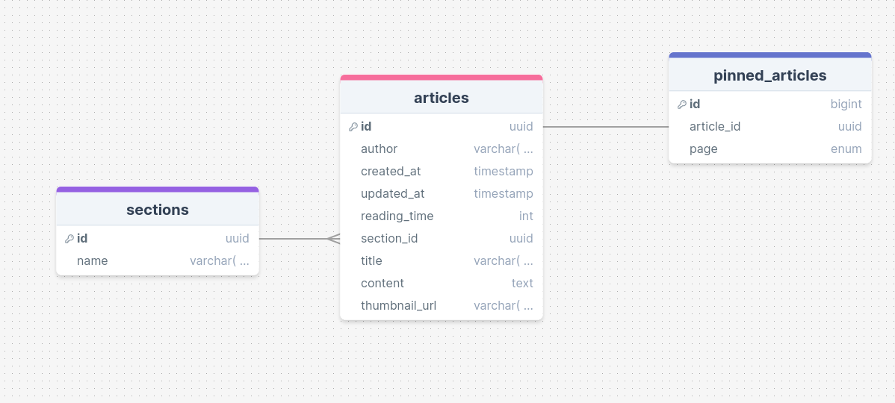

# База данных для omsk-hacker сайт

## Как запустить

```shell
$ docker compose up -d
```

## Как удалить все данные в БД

```shell
$ docker compose down -v
```

## Связи в БД

### Sections - разделы блога

У sections есть только два поля - id и name

Name - наименование раздела, имя уникальное

### Articles - статьи блога

У статьи представлены следующие поля

author - Имя + фамилия автора,

created_at - Время создания статьи,

updated_at - Время последнего редактирования статьи,

thumbnail_url - URL картинки превью статьи,

reading_time - Время чтения статьи в минутах,

section_id - Внешний ключ на раздел статьи (ссылка на id),

title - Заголовок статьи,

content - Содержание статьи в формате Markdown V2

### Закрепленные статьи

На некоторых страницах могут быть закрепленные статьи, на определенную страницу - своя статья

В схеме БД есть enum для страниц (перечисление), где будут содержаться закрепленные статьи, на данный момент таких страниц только две - "О Нас" и "Организация CTF"

В таблице pinned_articles (закрепленные статьи) представлены следующие поля:

article_id - внешний ключ на статью (ссылка на id статьи), 
page - Наименование страницы, где присутствует данная статья

**Примечание**
На странице должна присутствовать только ОДНА статья и не больше

### Страницы сайта, использующие БД

#### О Нас и Организация CTF
Ранее я описал про страницы "О Нас" и "Организация CTF" которые берут закрепленные статьи. 
Пример запроса может выглядеть так:

```sql
SELECT * FROM pinned_articles JOIN articles ON articles.id = pinned_articles.article_id WHERE page = 'ABOUT';
```

Данный запрос запрашивает статью, закрепленной на странице "О Нас"

#### Index
Index страница должна подгружать последние данные из таблицы articles 

Пример запроса:

```sql
SELECT * FROM articles ORDER BY created_at DESC LIMIT 3;
```

Данный запрос запрашивает последние 3 статьи блога

#### Страница статьи

На данной странице мы запрашиваем конкретную статью

```sql
SELECT * FROM articles WHERE id = 'b0a54e15-c8dc-4aa4-b3fb-03bb76f5fb95';
```

Данный запрос запрашивает статью с id b0a54e15-c8dc-4aa4-b3fb-03bb76f5fb95

## Схема БД



Ссылка на схему: https://drawsql.app/teams/enmex/diagrams/omskhackers